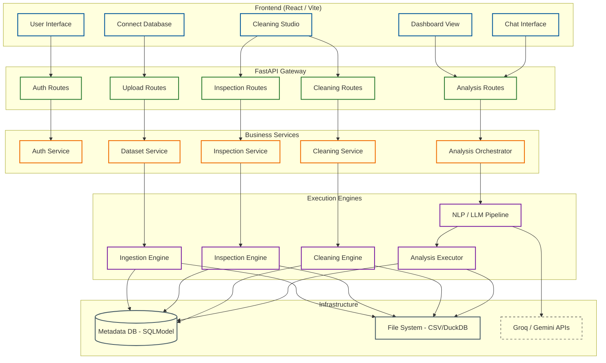

# ⚡ Vizzy Analytics — Master Codebase Context (Memory Map)

This file contains the complete conceptual and structural map of the Vizzy Analytics codebase, serving as a persistent memory interface for planning, implementation, dependency analysis, and impact tracking.

---

## 📝 Recent Architectural Changes Log

### **Pivoted Grouped Charts & SQL Partition Rules (2026-07-02)**
- **Feature (Dynamic Row HBAR Charts)**: Enhanced `renderStackedBarChart` and `renderBarChart` in `ChartRenderer.tsx` to detect queries with multiple dimensions and a single metric (e.g. Segment, Sub-Category, sales) and render them as a vertically stacked list of cards (one by one) for better visibility, with each card displaying a full-width compact horizontal bar chart (HBAR) for its respective segment (e.g. Consumer, Corporate, Home Office).
- **Feature (Composite Dimension Labels)**: Updated `renderBarChart` in `ChartRenderer.tsx` to concatenate all non-numeric columns (e.g., `Consumer - Chairs`) for multi-dimensional single-metric datasets.
- **Bug Fix (Backend _build_bar Columns Preservation)**: Updated `_build_bar` in `nl2sql_chart_builder.py` to copy all fields from raw SQL rows into the final chart row data array rather than filtering them down to only `category_col` and `value_col`. This preserves secondary category dimensions (like `Sub-Category`), allowing the frontend to successfully run composite labeling or row-split HBAR rendering.
- **Bug Fix (Backend _build_bar Slicing Bypass & Group-wise Slicing)**: Enhanced `_build_bar` in `nl2sql_chart_builder.py` to identify composite dimensions and apply a group-wise `top_n` slice (slicing each segment down to top `N` elements separately) rather than slicing globally, while keeping single-dimension queries globally sliced. This ensures only the top 3 sub-categories are shown for each segment, while preventing segments from being globally deleted.
- **Bug Fix (Backend Key Insight Dimensions Selection)**: Refined `_extract_key_insight` in `nl2sql_chart_builder.py` to explicitly exclude numeric value columns (int/float) from category candidate columns rather than using a heuristic score threshold, ensuring the correct category/sub-category labels are selected for the auto-generated key insight text.
- **Feature (Bypass Frontend Slicing)**: Refined `renderBarChart` to skip `topN` frontend slicing if the query contains composite/grouped dimensions, preserving all groups returned by SQL.
- **SQL Rule (DuckDB Partition Limit)**: Added Rule 19 in `sql_generator.py` system prompt to prevent ClickHouse syntax (`LIMIT N BY`) leakage and enforce correct DuckDB `QUALIFY ROW_NUMBER() OVER (...) <= N` placement BEFORE the `ORDER BY` clause.

### **Minimalist Thought UI, Formatting Fixes & Context Bleed (2026-07-02)**
- **UI Redesign (Claude-style Thought Logs)**: Relocated the persistent thought process accordion from the bottom of assistant message cards to the top in `ChatInterface.tsx`. Removed raw list numbering, replacing it with timeline dots and vertical accent borders. Added a dynamic analyst transition line (e.g., *“Based on the query execution and data retrieval, here is the trend analysis:”*) that adapts to the query's intent (KPI, trend, comparative, general).
- **Bug Fix (Compact Formatting Zero-Strip)**: Resolved a bug in `chat_routes.py` and `nl2sql_chart_builder.py` where formatting integer values (e.g. `720K`) stripped trailing zeros via `rstrip("0")` when decimal count was `0` (rendering them as `72K`). Now, stripping only occurs if a decimal point `.` is present in the formatted string.
- **Bug Fix (Conversation Context Bleed)**: Refined SQL generator system prompt (Rule 14) in `sql_generator.py` to command the model to ignore and discard metrics/dimensions from previous conversation context when the current query asks for a completely different metric.
- **Bug Fix (Babel JSX Syntax)**: Balanced brackets at the end of the map statement (`})}` and `);`) in `ChatInterface.tsx` to resolve Vite compiler syntax errors.

### **Thought SSE Events (2026-07-02)**
- **Feature (Chat Streaming Pipeline)**: Added `thought` SSE events to `send_message_stream` in `chat_routes.py`. An `emit_thought` helper inside `event_generator()` pushes timestamped, sequentially-numbered thought objects to the async queue at 10 decision points (intent classification, schema query detection, orchestrator routing, NL2SQL routing, dataset table load, SQL execution success, chart type detection, legacy fallback, no-dataset guidance, suggestion generation). A new `thought` handler in the SSE loop yields these as `event: thought` without breaking the stream. No other endpoints modified. Emojis cleaned up in the output string.

### **Bug Fixes Applied (2026-07-01)**
- **Bug (JWT Auth / Pydantic Settings)**: Resolved a nested Pydantic settings loading issue where JWT configuration secrets were not loaded correctly from the `.env` file. Fix: explicitly configured `model_config = SettingsConfigDict(env_file=".env", extra="ignore")` for all nested configuration sub-classes in `backend/app/core/config.py`.
- **Bug #1 (Deep Dive Routing)**: Added validation for `datasetId` and `initialPrompt` parameters in `UserDashboard.tsx` `handleDeepDive` function
- **Bug #2 (Chat State Initialization)**: Added error handling for undefined/malformed state from `useLocation` in `ChatInterface.tsx`
- **Bug #3 ("Think" Mode Routing)**: Verified `force_deep_analysis` flag is properly passed through routing chain in `chat_routes.py`
- **Bug #4 (Deep Analysis Prompting)**: Verified strict `**Key Insight:**` format enforcement in `executor.py` `_run_synthesis` method
- **Bug #5 (Dashboard Stream Event Leak)**: Implemented SSE generator cleanup in `dashboard_load_routes.py` to prevent resource leaks
- **Bug #6 (Semantic Mapping Drift)**: User corrections now prioritized over LLM proposals in `UserDashboard.tsx` semantic map saving
- **Bug #7 (Join Builder State)**: Verified no race conditions in `JoinBuilder.tsx` component
- **Bug #8 (Chart Renderer Race)**: Verified no race conditions in `ChartRenderer.tsx` components (chat and dashboard)
- **Bug #9 (SQL Injection)**: Confirmed `sandbox.py` already protected with AST validation and row limiting
- **Bug #10 (Cleaning Plan Race)**: Added double-check for plan approval status before execution in `cleaning_plan_routes.py`
- **Bug #11 (Dataset Metadata Hot Path)**: Reduced redundant latest-version lookups in `dataset_routes.py` metadata/status endpoints to cut DB load during page transitions
- **Bug #12 (Dataset Route UUID Safety)**: Hardened `dataset_routes.py` to return 401 for malformed auth user IDs instead of surfacing 500s on list/status/metadata calls
- **Bug #13 (Page Transition 500s — SQLite Concurrency)**: Fixed 500 Internal Server Errors when navigating between Dataset Viewer/Downloads pages. Root cause: SQLite default journal mode blocks concurrent reads under burst API traffic (N×3 calls per page). Fix applied across 6 files:
  - `database.py`: Enabled WAL mode + busy_timeout for concurrent read support
  - `dataset_routes.py` + `dataset_version_routes.py`: Added catch-all Exception handlers returning 503 instead of raw 500s
  - `Downloads.tsx` + `DatasetList.tsx`: Added AbortController cleanup on unmount to cancel stale in-flight requests
  - `client.ts`: Added automatic retry on 503 with 800ms backoff
- **Data health studio select dataset dropdown redesign**: Replaced the native select overlay with a custom stateful dropdown in `DataCleaning.tsx` using `ChevronDown`, `Check` and a floating container styled for both light and dark themes.
- **Dashboard filter response fix (stale cache bypass)**: Fixed an issue where changing values in dashboard filters did not respond or update charts on initial load. Root cause: the `useEffect` hook that loads analytics returned early when restoring lightweight metadata from memory/session cache, completely bypassing the background refetch of `raw_data`. Consequently, the local filtering engine lacked raw data to recompute values, keeping charts frozen until a manual page refresh. Fix: updated the cache restoration checks in [UserDashboard.tsx](file:///D:/Vizzy%20Redesign/Vizzy%20Redesign/frontend/src/pages/user/UserDashboard.tsx) to still schedule the background refetch of raw data if it is missing from the cached payload.
- **Dashboard filter response override fix**: Fixed an issue where changing a filter returned "No Data" for some charts. Root cause: the asynchronous background `loadKpisForInteractiveState` fetched filtered analytics from the server and called `syncServerChartData`, overwriting the store's chart data with server fallbacks (which default to empty data arrays `[]` under heavy filters). Fix: modified [UserDashboard.tsx](file:///D:/Vizzy%20Redesign/Vizzy%20Redesign/frontend/src/pages/user/UserDashboard.tsx) to skip syncing server charts and overwriting the local store's charts if `rawData` is already present locally, ensuring the high-fidelity local recomputations are preserved.
- **Sales dashboard missing category and sub-category charts fix**: Fixed an issue where the Key Insights tab in the sales dashboard omitted revenue and profit charts for "Sub-Category" when a "Category" column was present. Root cause: the semantic column detection in `domain_commercial.py` grouped "category" and "subcategory" keywords into a single `category_col` variable, allowing only one of them to be matched and visualized. Fix: separated `category_col` and `subcategory_col` detection logic in [domain_commercial.py](file:///D:/Vizzy%20Redesign/Vizzy%20Redesign/backend/app/services/analytics/chart_recommender/domain_commercial.py) and added `subcategory` to the `core_dims` iteration array to guarantee both dimensions receive dedicated revenue and profit insight charts.
- **Exhaustive metric-dimension pairing for All Columns tab**: Updated the `_generate_all_columns_charts` chart recommender algorithm in [recommender.py](file:///D:/Vizzy%20Redesign/Vizzy%20Redesign/backend/app/services/analytics/chart_recommender/recommender.py) to execute a full combinatorial pass (Phase 0). This cross-pairs every primary metric (numeric) with every valid dimension (categorical), guaranteeing that no possible pairing gets missed in the secondary "All Columns" tab, while preventing duplication with curated charts in the Key Insights tab.
- **Sales dashboard region charts and volume scale-up**: The `region` dimension has been explicitly added to the core dimensions array in the commercial engine to guarantee Region-based charts appear prominently in the Key Insights tab, bypassing standard geographic deduction which could omit it if state/country were present. The overall Key Insights chart limit has also been increased to 35+ to ensure a richer dashboard experience.
- **Map multi-metric tooltip filtering fix**: Fixed an issue where interactive dashboard filtering caused map charts (GeoCharts) to lose their secondary metrics (e.g., reverting from showing both Revenue and Profit to just Revenue). Root cause: the frontend filtering engine (`useFilterStore.ts`) did not know which raw database columns corresponded to the secondary metrics displayed in the tooltip. Fix: updated the backend `domain_ops.py` to embed a `raw_metrics` dictionary inside the map chart payload, and rewrote the frontend `geo_map` recalculation logic to perform a single O(N) pass accumulating scaled totals for all `raw_metrics` keys, seamlessly retaining the rich multi-variable tooltip on filtering.
- **Robust KPI extraction across datasets**: Fixed an issue where some sales datasets (like Superstore) failed to generate Gross Margin and Discount Impact KPIs despite having the necessary columns. Root cause: the data profiler occasionally categorized low-variance or zero-heavy numeric columns (like `Discount` or `Profit`) as `excluded`, hiding them from the standard KPI extraction logic. Fix: updated `kpi_engine.py` to force `search_excluded=True` for all critical commercial columns (revenue, profit, discount, quantity, customer, product, region, state), ensuring reliable KPI generation regardless of the profiler's classification.
- **User-mandated KPI exclusion fix**: Fixed an issue where manually assigning a column to the "Excluded" role in the dashboard's column classification panel did not actually prevent the KPI engine from generating metrics for it. Root cause: the KPI engine aggressively searched all columns, including excluded ones, for matching metrics. Fix: added a `user_excluded` array to the `ColumnClassification` dataclass in `column_filter.py`, populated it dynamically in `analytics_routes.py` when user overrides are applied, and updated `_find_column` in `kpi_engine.py` to strictly block KPI generation for any column flagged in `user_excluded`.
- **Dashboard state persistence and cache-first navigation**: Fixed issues where user-configured column classifications were lost on page refresh, and navigating away from the dashboard and back caused a full reload (flicker and API calls) that wiped out active filters. Root causes: `useFilterStore.ts` aggressively wiped state on dataset mount, and `UserDashboard.tsx` explicitly called the `auto-render` API endpoint on every mount instead of checking the cache. Fixes: added an `isInitialLoad` check in `useFilterStore.ts` to hydrate state from `localStorage` instead of wiping it, and replaced `triggerAutoRender` with `restoreOrAutoRender` in `UserDashboard.tsx` to instantly hydrate the dashboard from the `sessionStorage` cache if available, preventing unnecessary server round-trips and preserving the active interactive state.

### **2026-06-26: Analyst Team Routing & Dashboard Integration**
- **Dashboard Deep Dive**: `UserDashboard.tsx` (`handleDeepDive`) now uses React Router `useNavigate` to redirect to `/user/chat`, passing `datasetId` and `initialPrompt` in state.
- **Chat State Initialization**: `ChatInterface.tsx` uses `useLocation` to read routing state, automatically setting the active dataset and pre-filling the chat box.
- **"Think" Mode Routing**: `chat_routes.py` (`force_deep_analysis=True`) now correctly routes to the `Executor` (Multi-Agent flow) rather than bypassing it for the legacy diagnostic script.
- **Deep Analysis Prompting**: `executor.py` (`_run_synthesis`) now enforces a strict `**Key Insight:**` format with strategic causality/anomaly extraction when `force_deep_analysis` is active, replacing basic chart descriptions.
<!--  -->
---

## 🏗️ System Architecture Overview

Vizzy Analytics is a full-stack natural language query engine that translates plain-text questions into validated database operations, executes them via a hybrid engine, streams results, and preserves an immutable cleaning and transformation log.



---

## 📁 Backend Directory Map (`/backend`)

The backend is written in Python 3.10+ using FastAPI and managed with SQLModel (SQLAlchemy) and DuckDB/Pandas analytical pipelines.

### Root
- **`main.py`**: Vizzy Analytics Platform API
  - Classes: SecurityHeadersMiddleware
  - Functions: lifespan, authentication_error_handler, authorization_error_handler, not_found_handler, invalid_operation_handler, app_exception_handler, health_check

### Api
- **`api/__init__.py`**: API layer package.
- **`api/analysis_contract_routes.py`**
  - Classes: AnalysisContractCreateRequest, AnalysisContractResponse
  - Functions: create_analysis_contract, get_active_contract, deactivate_contract
- **`api/analysis_nl_routes.py`**
  - Classes: NLQueryRequest
  - Functions: run_nl_analysis
- **`api/analysis_routes.py`**
  - Classes: AnalysisRunRequest, AnalysisResultResponse, AnalysisResultListResponse
  - Functions: run_analysis, list_analysis_results, get_analysis_result
- **`api/analytics_routes.py`**: Analytics API routes.
  - Classes: DashboardAnalyticsResponse, DashboardStateRequest, NarrativeRequest, CausalAnalysisRequest, CausalAnalysisResponse
  - Functions: _find_target_column, _normalize_binary_target_values, _currency_symbol_from_code, _is_currency_label, _format_narrative_value, _normalize_filter_value, _scalar_filter_match, _binary_target_value_match, _is_filtered_dashboard_request, _build_duckdb_chart_configs, _try_duckdb_analytics, _backfill_date_trends_with_duckdb, auto_render_dashboard, get_dashboard_analytics, get_pivot_table, get_correlation_matrix, _summarize_charts, generate_narrative, get_causal_analysis
- **`api/audit_routes.py`**
  - Classes: AuditEventResponse, AuditStatsResponse
  - Functions: list_all_events, filter_events, list_events_for_user, list_events_for_resource, get_recent_events, get_audit_statistics
- **`api/auth_routes.py`**
  - Classes: RegisterRequest, LoginRequest, TokenResponse, RefreshRequest, AccessTokenResponse, MessageResponse
  - Functions: register, login, login_user, login_admin, refresh_token_endpoint
- **`api/chat_routes.py`**: Chat API routes.
  - Classes: CreateSessionRequest, UpdateSessionRequest, SendMessageRequest, MessageResponse, SessionResponse, ChatResponse, SessionListResponse, MessageListResponse, NLQueryRequest, NLQueryResponse
  - Functions: _is_simple_chat_query, _build_simple_chat_response, _is_percentage_kpi, _format_percentage_value, _looks_percentage_metric_name, _is_currency_kpi, _currency_symbol_from_code, _kpi_currency_symbol, _format_compact_value, _looks_currency_metric_name, _metric_currency_symbol, _build_numbered_metric_summary, _looks_interpretive_query, _parse_clarification_sentence, _rewrite_clarification_query, _normalize_nl2sql_query, _explicitly_requests_visual, _is_schema_columns_query, _read_dataset_columns, _build_columns_response, _normalize_orchestrator_response, _normalize_query_text, _remember_query, _index_queries_from_messages, _should_attempt_replay_lookup, _find_prior_exact_answer, _ensure_point_style, _extract_diagnostic_sql_queries, create_session, list_sessions, get_session, update_session, delete_session, get_messages, send_message, send_message_stream, get_initial_suggestions, nl_query
- **`api/cleaning_plan_routes.py`**
  - Classes: CleaningPlanCreateRequest, CleaningPlanResponse
  - Functions: create_cleaning_plan, get_cleaning_plan, approve_cleaning_plan, _convert_actions_to_steps, preview_cleaning_plan, execute_cleaning_plan
- **`api/dashboard_load_routes.py`**
  - Classes: DashboardJSONEncoder
  - Functions: sanitize_nan, _dumps, get_dashboard_configs, dashboard_event_generator, load_dashboard
- **`api/dashboard_routes.py`**: Saved dashboard routes.
  - Classes: SaveDashboardRequest, UpdateDashboardRequest, DashboardResponse, DashboardListResponse
  - Functions: save_dashboard, list_dashboards, get_dashboard, update_dashboard, delete_dashboard
- **`api/dataset_routes.py`**
  - Classes: DatasetCreateRequest, DatasetResponse, DatasetListResponse, DuckDBStatusResponse, DatasetMetadataResponse
  - Functions: create_dataset, list_datasets, get_dataset, delete_dataset, get_dataset_duckdb_status, get_dataset_metadata
- **`api/dataset_version_routes.py`**
  - Classes: VersionCreateRequest, MappingCorrectionRequest, MappingConfirmRequest, VersionResponse, VersionListResponse
  - Functions: create_version, list_versions, get_latest_version, get_version, propose_mapping, confirm_mapping, remap_mapping_preview, remap_mapping_confirm
- **`api/deps.py`**
  - Functions: get_db, verify_dataset_owner, verify_dataset_version_owner
- **`api/download_routes.py`**: Download and export routes.
  - Classes: DownloadHistoryItem, QueryExportRequest
  - Functions: get_download_history, download_raw_dataset, download_cleaned_dataset, download_latest_raw_dataset, download_latest_cleaned_dataset, enforce_export_limit, export_query_results, export_table
- **`api/external_db_routes.py`**: External database connection routes.
  - Classes: TestConnectionRequest, TestConnectionResponse, ListTablesRequest, IngestFromExternalDBRequest
  - Functions: test_external_database_connection, list_external_database_tables, ingest_from_external_database
- **`api/inspection_routes.py`**
  - Classes: InspectionResponse
  - Functions: run_inspection, get_inspection_report
- **`api/relational_routes.py`**: Relational Data API routes.
  - Classes: JoinColumn, JoinConfig, CreateJoinRequest, JoinListResponse, JoinValidationRequest, JoinValidationResponse, ApplyJoinRequest, TableInfo, TablesListResponse
  - Functions: check_table_ownership_or_raise, _safe_table_name, _get_join_registry, _save_join_registry, _discover_tables_in_duckdb, _get_table_columns, upload_multiple_files, _build_multi_duckdb_background, list_dataset_tables, create_join, list_joins, delete_join, validate_join, apply_joins
- **`api/router.py`**
- **`api/sql_ingestion_routes.py`**
  - Functions: ingest_from_sql
- **`api/sql_transparency_routes.py`**: SQL Transparency API routes.
  - Classes: SQLExecuteRequest, SQLExecuteResponse, SQLExplainRequest, SQLExplainResponse, SQLValidateRequest, SQLValidateResponse
  - Functions: _get_duckdb_connection, _df_to_records_safe, execute_sql_query, explain_sql_query, validate_sql_query
- **`api/upload_routes.py`**
  - Functions: _sanitize_filename, _validate_file_security, upload_dataset_file, upload_dataset, _get_file_size, get_dataset_status
- **`api/user_routes.py`**: User management API routes.
  - Classes: UserCreateRequest, UserUpdateRequest, PasswordChangeRequest, UserResponse, UserListResponse, MessageResponse, ProfileUsageItem, MonthlyActivityItem, UserProfileStatsResponse, LLMSettingResponse, LLMSettingUpdateRequest
  - Functions: create_user, get_current_user_profile, update_current_user_profile, get_current_user_profile_stats, get_user_llm_settings, update_user_llm_settings, list_users, get_user, activate_user, deactivate_user, delete_user

### Core
- **`core/__init__.py`**: Core layer package.
- **`core/audit.py`**: Audit event recording module.
  - Classes: AuditEvent, AuditStore
  - Functions: get_audit_store, record_audit_event
- **`core/config.py`**: Application configuration module.
  - Classes: DatabaseSettings, AuthSettings, RateLimitSettings, StorageSettings, LLMSettings, Settings
  - Functions: _validate_sqlite_path, get_settings
- **`core/crypto.py`**
  - Functions: get_secret_key, _get_fernet, encrypt_val, decrypt_val
- **`core/exceptions.py`**: Custom exception classes.
  - Classes: VizzyException, AuthenticationError, AuthorizationError, ResourceNotFound, InvalidOperation, RateLimitExceeded, ValidationError, SecurityError
- **`core/input_validation.py`**: Input validation and sanitization module.
  - Functions: sanitize_text, sanitize_filename, validate_password_strength, sanitize_sql_identifier, sanitize_email_header, sanitize_column_name
- **`core/llm_client.py`**: Multi-provider LLM client with fallback support.
  - Classes: LLMProvider, LLMResponse, LLMClient
  - Functions: parse_json_response, get_llm_client
- **`core/logger.py`**: Centralized application logging module.
  - Classes: StructuredFormatter, SensitiveDataFilter
  - Functions: setup_logger, get_logger
- **`core/rate_limit.py`**: API rate limiting module.
  - Classes: RateLimitStore, RateLimiter, LoginAttemptStore
  - Functions: get_rate_limit_store, get_rate_limiter, check_rate_limit, get_login_attempt_store
- **`core/security.py`**: Security and authentication module.
  - Classes: UserRole, TokenData, CurrentUser
  - Functions: hash_password, verify_password, create_access_token, create_refresh_token, verify_token, _populate_user_llm_settings, get_current_user, get_current_user_from_header_or_query, require_role, verify_resource_ownership
- **`core/storage.py`**: Storage configuration module.
  - Functions: get_base_data_dir, get_version_dir, get_raw_data_path, get_cleaned_data_path, get_duckdb_path

### Models
- **`models/__init__.py`**: Models layer package.
- **`models/analysis_contract.py`**: Analysis contract database model.
  - Classes: AnalysisContract
- **`models/analysis_result.py`**: Analysis result database model.
  - Classes: AnalysisResult
- **`models/base.py`**: Base database model.
  - Classes: BaseModel
- **`models/chart_customization.py`**: Chart customization model.
  - Classes: ChartCustomization
- **`models/chat_message.py`**: Chat message model.
  - Classes: MessageRole, ChatMessage
- **`models/chat_session.py`**: Chat session model.
  - Classes: ChatSession
- **`models/cleaning_plan.py`**: Cleaning plan database model.
  - Classes: CleaningPlan
- **`models/database.py`**: Database engine and session management.
  - Functions: init_db, _ensure_mapping_corrections_table, _ensure_users_llm_settings_column, _ensure_users_name_column, _ensure_dataset_versions_semantic_map_json_column, _ensure_dataset_versions_status_column, _ensure_dataset_versions_schema_json_column, _ensure_dataset_versions_parent_version_id_column, _ensure_dataset_versions_change_type_column, _ensure_dataset_versions_approved_by_column, _ensure_dataset_versions_approved_at_column, _ensure_dataset_versions_chart_configs_json_column, _ensure_dataset_versions_duckdb_table_name_column, _ensure_dataset_versions_active_join_view_column, _ensure_dataset_versions_join_config_json_column, _ensure_dataset_tables_table, get_session
- **`models/dataset.py`**: Dataset database model.
  - Classes: Dataset
- **`models/dataset_table.py`**: DatasetTable database model.
  - Classes: DatasetTable
- **`models/dataset_version.py`**
  - Classes: SourceType, DatasetVersion
- **`models/inspection_report.py`**: Inspection report database model.
  - Classes: RiskLevel, InspectionReport
- **`models/mapping_correction.py`**: MappingCorrection — Stores user corrections to LLM-proposed semantic mappings.
  - Classes: MappingCorrection
- **`models/metric_definition.py`**
  - Classes: MetricDefinition
- **`models/saved_dashboard.py`**: Saved dashboard model.
  - Classes: SavedDashboard
- **`models/user.py`**: User database model.
  - Classes: UserRole, User

### Services
- **`services/__init__.py`**: Services layer package.
- **`services/analysis_contract_service.py`**
  - Functions: _assert_version_access, create_analysis_contract, get_active_contract_for_version, deactivate_contract
- **`services/analysis_orchestrator.py`**
  - Functions: _normalize_text, _collect_grounding_terms, _assess_diagnostic_evidence, _is_grounded_interpretive_output, _build_low_evidence_interpretive_response, _build_grounded_interpretive_fallback, _infer_currency_symbol, _format_number, _is_financial_label, _extract_points_from_text, _diagnostic_points_from_results, _format_explanation_as_points, _build_diagnostic_sql_queries, _calculate_pop_change, run_analysis_orchestration, _handle_analysis_chart, run_analysis_with_context
- **`services/analysis_service.py`**
  - Functions: _assert_version_access, create_analysis_result, list_results_for_version, get_result_by_id, generate_export_url
- **`services/audit_service.py`**: Audit service for querying and filtering audit events.
  - Functions: get_all_audit_events, get_user_audit_events, get_resource_audit_events, get_filtered_audit_events, get_audit_stats, get_recent_events
- **`services/chart_recommender.py`**
  - Classes: ChartConfig
  - Functions: generate_chart_configs
- **`services/chat_service.py`**: Chat service module.
  - Functions: create_chat_session, get_chat_session, list_user_sessions, update_session_title, delete_chat_session, add_user_message, add_assistant_message, get_session_messages, get_recent_context, auto_generate_title
- **`services/cleaning_plan_service.py`**
  - Functions: _assert_version_access, create_cleaning_plan, approve_cleaning_plan, get_cleaning_plan_for_version, get_plan_by_id
- **`services/dataset_service.py`**
  - Functions: _assert_dataset_access, create_dataset, get_dataset_by_id, list_datasets_for_user, list_datasets_with_details, get_dataset_details, deactivate_dataset, check_dataset_access
- **`services/dataset_table_service.py`**: DatasetTable service.
  - Functions: create_dataset_table, list_tables_for_version, get_primary_table, get_table_count, get_active_table_name
- **`services/dataset_version_service.py`**
  - Functions: _assert_dataset_access, _get_next_version_number, create_dataset_version, list_versions_for_dataset, get_latest_version, get_version_by_id, _fetch_column_profiles_for_ui, _fetch_historical_corrections, propose_semantic_mapping, confirm_semantic_mapping, remap_semantic_mapping, preview_remap_impact, resolve_semantic_map
- **`services/ingestion_service.py`**
  - Functions: ingest_file_upload, ingest_sql_query, _stream_to_path, _count_csv_rows, generate_initial_dashboard
- **`services/inspection_service.py`**
  - Functions: _assert_version_access, create_inspection_report, get_inspection_report_for_version, run_inspection
- **`services/role_taxonomy.py`**: Role Taxonomy — Single Source of Truth for Semantic Column Roles.
- **`services/semantic_audit.py`**: Semantic Audit Service
  - Functions: _table_name, _fetch_column_samples, _fetch_column_stats, run_semantic_audit
- **`services/user_services.py`**
  - Functions: create_user, get_user_by_email, update_user_profile, activate_user, deactivate_user, get_user_by_id, list_users, delete_user, _month_key, get_user_profile_stats

### Services/analysis_execution
- **`services/analysis_execution/analysis_executor.py`**
  - Functions: execute_analysis, _execute_aggregation, _execute_time_trend, _apply_filters
- **`services/analysis_execution/contract_builder.py`**
  - Functions: build_analysis_contract, _validate_operation_requirements
- **`services/analysis_execution/intent_registry.py`**
  - Functions: list_intent_categories, get_allowed_operations, match_intent_category
- **`services/analysis_execution/operation_catalog.py`**
  - Functions: get_operation, list_operations

### Services/analytics
- **`services/analytics/__init__.py`**: Analytics Engine Package.
- **`services/analytics/business_questions.py`**: Business Questions Framework - Defines domain-specific business questions.
  - Classes: BusinessQuestion
  - Functions: get_business_questions, get_prioritized_questions, get_question_for_chart, get_smart_chart_title, get_tenure_group, get_tenure_group_order
- **`services/analytics/causal_analysis.py`**: Causal Analysis Service
  - Classes: DriverAnnotation
  - Functions: _compute_correlation, _categorize_correlation_strength, _generate_explanation, analyze_drivers, generate_why_annotations
- **`services/analytics/chart_recommender/__init__.py`**: Chart Recommender Package - Smart chart selection based on data signals and domain.
- **`services/analytics/chart_recommender/aggregators.py`**: Safe aggregation helpers for chart data.
  - Functions: _safe_groupby_sum, _safe_groupby_mean, _safe_value_counts
- **`services/analytics/chart_recommender/churn_analytics.py`**: Churn Analytics - extracted from generators.py
  - Functions: _build_target_rate_chart, _get_churn_rate_by_segment, _get_value_at_risk, _get_lifecycle_cohorts, _find_highest_variance_dim, _get_stacked_churn_counts, _get_churned_vs_retained_avg, _get_churn_count_by_segment, _get_metric_cohort_analysis
- **`services/analytics/chart_recommender/churn_charts.py`**: Churn Charts - extracted from generators.py
  - Functions: _generate_churn_charts
- **`services/analytics/chart_recommender/domain_commercial.py`**: Domain Commercial - extracted from generators.py
  - Functions: _generate_sales_charts, _generate_marketing_charts, _generate_finance_charts, _generate_ecommerce_charts
- **`services/analytics/chart_recommender/domain_ops.py`**: Domain Ops - extracted from generators.py
  - Functions: _generate_geo_charts, _generate_generic_charts, _generate_logistics_charts, _generate_real_estate_charts, _generate_customer_support_charts, _generate_it_operations_charts, _generate_cybersecurity_charts
- **`services/analytics/chart_recommender/domain_workforce.py`**: Domain Workforce - extracted from generators.py
  - Functions: _generate_healthcare_charts, _infer_hr_metric_context, _generate_hr_charts, _generate_education_charts
- **`services/analytics/chart_recommender/geo.py`**: Geo Detection Helpers for map-based charts.
  - Functions: _detect_map_type
- **`services/analytics/chart_recommender/models.py`**: Models for the Chart Recommender system.
  - Classes: AggregationData, ChartRecommendation
- **`services/analytics/chart_recommender/prioritization.py`**: BI Dashboard Prioritization - Rank metrics and dimensions by business importance.
  - Functions: _should_average_metric, _is_whole_number_average_metric, _round_mean_value, _prioritize_metrics, _prioritize_dimensions, _pick_at_risk_metric, _metric_format_type, _get_metric_prefix, _infer_time_value_label, _trend_aggregation_for_metric
- **`services/analytics/chart_recommender/query_helpers.py`**: Query Helpers - extracted from generators.py
  - Functions: _smart_aggregate, _deduplicate_charts, _to_trend_point_key, _normalize_percentage_chart_values, _get_target_distribution, _distribution_chart, _get_target_by_segment, _get_time_trend, _get_yoy_comparison, _get_ytd_comparison, _get_scatter_data
- **`services/analytics/chart_recommender/recommender.py`**: Recommender - extracted from generators.py
  - Classes: ChartConfig
  - Functions: generate_chart_configs, _generate_templated_charts, _generate_all_columns_charts, recommend_charts
- **`services/analytics/chart_recommender/sanitization.py`**: Data sanitization and coercion for chart outputs.
  - Functions: _is_poison_value, _safe_float, _sanitize_chart_data, _coerce_numeric_metric_series, _safe_to_datetime
- **`services/analytics/chart_recommender/titles.py`**: Smart Title System - Map column names to professional business terms.
  - Functions: _humanize_column_name, _beautify_column_name, _clean_title, _create_smart_title, _is_low_value_column, _pick_column_by_keywords, _format_categorical_value, _get_binary_target_labels, _smart_target_label
- **`services/analytics/coercion.py`**
  - Classes: ColumnCoercionResult
  - Functions: build_clean_expression, coerce_column, _batch_nullify_strings, run_coercion_pipeline
- **`services/analytics/column_filter.py`**: Column Filter - Classifies and prioritizes columns for analytics.
  - Classes: ColumnClassification
  - Functions: _clean_header, _detect_modifiers, _is_identifier_column, _is_binary_flag, _is_date_column, _is_target_column, _get_column_priority, filter_columns, filter_columns_duckdb
- **`services/analytics/csv_loader.py`**: Shared CSV loader for analytics paths.
  - Functions: _safe_read_csv_impl, _cached_read_csv, safe_read_csv
- **`services/analytics/data_profiler.py`**: Data Profiler - Statistical analysis of dataset columns.
  - Classes: ColumnProfile, DataProfiler
  - Functions: _to_json_safe
- **`services/analytics/db_engine.py`**
  - Classes: DBEngine
  - Functions: get_db_engine
- **`services/analytics/diagnostic_battery.py`**: Interpretive Diagnostic Battery.
  - Functions: _quote_identifier, _dimension_alias, _is_binary_numeric, _normalize_col_name, _find_mentioned_columns, _infer_metric_from_query, _infer_target_from_query_keywords, _build_diagnostic_queries, _build_sql_for_diagnostic, _execute_diagnostic, _execute_diagnostic_sql, _execute_diagnostic_batch_sql, run_diagnostic_battery
- **`services/analytics/domain_detector.py`**: Domain Detector - Identifies dataset domain based on column patterns.
  - Classes: DomainType
  - Functions: _calculate_domain_score, detect_domain, get_domain_confidence
- **`services/analytics/dsl_layout_generator.py`**: DSL Layout Generator - Generates declarative dashboard configurations.
  - Classes: GridLayout, DataBindings, Widget, DashboardDSL
  - Functions: get_dsl_json_schema, validate_dsl_layout, generate_dsl_layout
- **`services/analytics/duckdb_builder.py`**: DuckDB Builder Service.
  - Functions: _get_duckdb_status_marker_paths, mark_duckdb_building, mark_duckdb_ready, mark_duckdb_failed, get_duckdb_build_status, build_duckdb_from_csv, get_or_build_duckdb, duckdb_exists, add_table_to_duckdb
- **`services/analytics/duckdb_chart_builder.py`**: DuckDB Chart Query Builder.
  - Functions: _normalize_filter_token, _binary_bucket, _binary_sql_condition, _normalize_aggregation, _get_chart_config_value, build_filter_where_clause, get_parsed_date_expr, build_chart_query, execute_chart_queries, build_kpi_query, execute_kpi_queries
- **`services/analytics/duckdb_cleanup.py`**: DuckDB Cleanup Service.
  - Functions: get_duckdb_file_stats, find_old_duckdb_files, cleanup_old_duckdb_files, schedule_cleanup_job
- **`services/analytics/duckdb_pipeline.py`**
  - Functions: run_duckdb_pipeline
- **`services/analytics/duckdb_reader.py`**: DuckDBReader — read-only analytics query utility for dashboard generation.
  - Classes: DuckDBReader
- **`services/analytics/execution_router.py`**
  - Functions: execute_dashboard_load
- **`services/analytics/executor.py`**
  - Classes: Executor
  - Functions: _extract_current_question, _extract_clarification_marker, _extract_resolution_keywords, _build_business_semantic_hints, _render_hint_lines
- **`services/analytics/index_manager.py`**: Index manager for DuckDB analytical tables.
  - Functions: _get_date_like_types, _is_low_cardinality_categorical, _index_name, _batch_compute_cardinality, create_performance_indices, _order_table_by_date
- **`services/analytics/join_manager.py`**: Join Manager Service.
  - Classes: JoinManager
- **`services/analytics/kpi_engine.py`**: KPI Engine - Generates calculated KPIs based on domain and data.
  - Classes: KPI
  - Functions: _safe_to_datetime, _beautify_column_name, _find_column, _safe_sum, _safe_mean, _normalized_col, _is_effectively_numeric, _is_lifecycle_column, _is_financial_column, _pick_best_churn_value_metric, _pick_churn_arpu_metric, _count_target_positive, _to_numeric_series, _is_rate_metric_name, _infer_rate_scale, _rate_series_to_percent, _binary_positive_share_percent, _marketing_metric_role, _marketing_metric_icon, _is_identifier_like_metric, _marketing_groupby_aggregate, _find_marketing_entity_identifier, _generate_sales_kpis, _generate_churn_kpis, _generate_marketing_kpis, _generate_finance_kpis, _generate_healthcare_kpis, _generate_hr_kpis, _generate_logistics_kpis, _generate_education_kpis, _generate_ecommerce_kpis, _generate_real_estate_kpis, _generate_customer_support_kpis, _generate_it_operations_kpis, _generate_cybersecurity_kpis, _generate_generic_kpis, _kpi_confidence_score, _dedupe_kpis, _dynamic_kpi_limit, _kpi_priority_bonus, _select_top_kpis, generate_kpis_duckdb, generate_kpis
- **`services/analytics/metadata_profiler.py`**: Metadata Profiler - Analyzes dataset columns to generate physical, logical, and semantic metadata.
  - Functions: profile_dataset, _detect_semantics_and_format, _get_duckdb_physical_type_map, profile_dataset_duckdb
- **`services/analytics/outlier_detection.py`**
  - Functions: detect_outliers_iqr
- **`services/analytics/pandas_pipeline.py`**
  - Functions: build_preagg_sql, apply_formula, run_pandas_pipeline
- **`services/analytics/pattern_engine.py`**: Pattern Engine - Identifies universal analysis patterns based on semantic roles.
  - Classes: AnalysisPattern, PatternEngine
- **`services/analytics/pivot_generator.py`**: Pivot Table Generator
  - Classes: PivotConfig
  - Functions: _beautify_name, _get_aggregation_type, generate_pivot_config, _generate_sales_pivot, _generate_churn_pivot, _generate_marketing_pivot, _generate_finance_pivot, _generate_generic_pivot, generate_pivot_data, _generate_simple_pivot, _generate_crosstab_pivot
- **`services/analytics/pre_mapper.py`**: PreMapper - Deterministic role assignment for obvious patterns.
  - Classes: PreMapper
- **`services/analytics/query_cache.py`**
  - Functions: get_cached, set_cached, clear_cache
- **`services/analytics/query_utils.py`**: Safe parameterized SQL execution for DuckDB.
  - Classes: QuerySafetyError
  - Functions: safe_identifier, safe_table_ref, execute, execute_df, build_in_clause
- **`services/analytics/role_resolver.py`**: Role Resolver - Utility for resolving semantic roles to actual column names.
  - Functions: detect_map_format, normalize_to_col_role, normalize_to_role_columns, invert_to_role_map, resolve_column_by_role, resolve_columns_by_role, get_all_resolved_roles
- **`services/analytics/section_registry.py`**: Section Registry — Domain-aware chart grouping rules.
  - Classes: SectionRule, SectionAssignment
  - Functions: _normalize, _matches, assign_section
- **`services/analytics/semantic_mapper.py`**: Semantic Mapper - LLM-assisted role mapping for dataset columns.
  - Classes: ColumnMapping, SemanticMap, SemanticMapper
- **`services/analytics/semantic_resolver.py`**: Semantic Column Resolver — Fuzzy matching bridge for analytics engines.
  - Functions: normalize, expand_abbreviations, semantic_similarity, find_column, find_column_with_score, find_ambiguous_columns, match_columns_to_keywords, get_column_semantic_role
- **`services/analytics/table_resolver.py`**: Table Name Resolver.
  - Functions: resolve_table_name, resolve_table_name_from_version

### Services/cleaning_execution
- **`services/cleaning_execution/__init__.py`**: Cleaning execution package.
- **`services/cleaning_execution/execute_cleaning.py`**
  - Functions: execute_and_save_cleaning
- **`services/cleaning_execution/executor.py`**
  - Functions: execute_plan
- **`services/cleaning_execution/planner.py`**
  - Functions: execute_cleaning
- **`services/cleaning_execution/recommendations.py`**: Recommendations generator module.
  - Functions: generate_recommendations, build_cleaning_actions_from_recommendations
- **`services/cleaning_execution/rule_engine.py`**
  - Functions: build_execution_plan, _validate_plan_structure, _validate_step
- **`services/cleaning_execution/rules.py`**
  - Functions: drop_rows_with_nulls, fill_missing_mean, fill_missing_median, trim_string_columns, _validate_columns, _validate_numeric_columns, remove_duplicates, cap_outliers

### Services/ingestion_execution
- **`services/ingestion_execution/__init__.py`**: Ingestion execution package.
- **`services/ingestion_execution/db_connector.py`**
  - Functions: _validate_select_query, load_from_database, load_dataframe_for_version
- **`services/ingestion_execution/external_db.py`**: External database connection management.
  - Classes: DatabaseConnection
  - Functions: build_connection_string, create_external_engine, test_database_connection
- **`services/ingestion_execution/file_loader.py`**: File loader module.
  - Functions: validate_file, _validate_file_extension, _validate_file_size, _read_csv_with_encodings, _load_csv, load_csv_sample, _load_excel, _load_json, _load_xml, _load_parquet, load_from_path, load_from_upload
- **`services/ingestion_execution/schema_inference.py`**: Schema inference module.
  - Functions: infer_schema, _normalize_dtype, _compute_schema_hash
- **`services/ingestion_execution/version_builder.py`**
  - Functions: build_dataset_version

### Services/inspection_execution
- **`services/inspection_execution/__init__.py`**: Inspection execution package.
- **`services/inspection_execution/anomaly_checks.py`**
  - Functions: detect_numeric_anomalies, _analyze_column_outliers
- **`services/inspection_execution/duplicate_checks.py`**: Duplicate detection module.
  - Functions: detect_duplicates, get_duplicate_groups, _validate_columns, _serialize_value
- **`services/inspection_execution/inspector.py`**
  - Functions: run_inspection
- **`services/inspection_execution/profiler.py`**
  - Functions: profile_dataframe, _profile_column, _get_sample_values, _serialize_value
- **`services/inspection_execution/risk_scorer.py`**
  - Functions: score_risk, _high, _medium, _low, calculate_health_score, _score_to_grade
- **`services/inspection_execution/time_checks.py`**
  - Functions: check_time_columns, _detect_time_column, _can_convert_to_datetime, _detect_time_issues, _extract_time_stats

### Services/llm
- **`services/llm/__init__.py`**: LLM integration package.
- **`services/llm/chart_explainer.py`**: Chart explanation generator module.
  - Functions: _format_number_value, _normalize_binary_label, _build_chart_context, generate_chart_explanation, _generate_fallback_explanation
- **`services/llm/column_matcher.py`**: Column matcher module.
  - Functions: normalize_column_name, similarity_score, find_best_column_match, find_all_column_matches, suggest_similar_columns, build_column_alias_map, resolve_column_from_query
- **`services/llm/intent_classifier.py`**: Intent classifier module.
  - Functions: _detect_visualization_intent, _detect_dashboard_intent, build_user_prompt, classify_intent, _fast_score, classify_intent_fast
- **`services/llm/intent_mapper.py`**
  - Functions: map_intent_to_operation, _assert_required_fields, _build_time_block
- **`services/llm/intent_schema.py`**
  - Classes: IntentType, Aggregation, TimeGranularity, AnalysisIntent
- **`services/llm/intent_validator.py`**
  - Functions: validate_intent, _validate_intent_type, _validate_aggregation, _resolve_and_validate_metric, _resolve_and_validate_group_by, _resolve_and_validate_time
- **`services/llm/llm_router.py`**
  - Classes: LLMRouter
- **`services/llm/memory_manager.py`**
  - Classes: MemoryManager
- **`services/llm/prompt_templates.py`**
- **`services/llm/refusal_service.py`**
  - Classes: RefusalService
- **`services/llm/response_formatter.py`**: Response formatter module.
  - Functions: format_analysis_response, format_dashboard_response, format_error_response, format_text_response, _generate_text_followups, _build_response_message, _generate_default_followups, format_message_for_storage
- **`services/llm/semantic_column_resolver.py`**: Semantic column resolver module.
  - Functions: find_semantic_column_match, get_business_term_suggestions, resolve_metric_with_semantics
- **`services/llm/sql_generator.py`**
  - Classes: SQLGenerator
- **`services/llm/sql_validator.py`**
  - Classes: SQLValidator
- **`services/llm/suggestion_generator.py`**
  - Functions: generate_contextual_suggestions
- **`services/llm/text_answer_generator.py`**: Text answer generator module.
  - Functions: _is_greeting_query, _is_general_data_analytics_question, _build_general_knowledge_context, _format_column_name, _resolve_metric, generate_text_answer_async, generate_text_answer, _format_number, _format_count_grouped, _format_sum_grouped, _format_avg_grouped, _generate_data_summary, _error_response
- **`services/llm/token_optimizer.py`**: Token optimization utilities for LLM calls.
  - Functions: sample_dataframe, truncate_text, get_column_summary, compress_prompt, cache_response, get_cached_response, generate_cache_key, clear_cache, get_cache_stats, optimize_data_for_llm

### Services/security
- **`services/security/sandbox.py`**
  - Classes: QueryExecutionError
  - Functions: validate_sql, sanitize_error_message, execute_sandboxed

### Services/visualization
- **`services/visualization/__init__.py`**: Visualization package.
- **`services/visualization/chart_specs.py`**: Chart specification module.
  - Classes: ChartType
  - Functions: build_chart_spec, _build_kpi, _build_bar, _build_line, _build_pie, _build_table, _build_scatter, _build_area, _build_heatmap, get_supported_chart_types
- **`services/visualization/dashboard_builder.py`**
  - Functions: build_dashboard, _build_kpi_widget, _build_bar_widget, _build_line_widget, _generate_widget_id
- **`services/visualization/dashboard_filters.py`**: Dashboard filters module.
  - Classes: FilterOperator
  - Functions: apply_filter, apply_filters, get_filter_options, get_all_filter_options, build_filter_summary
- **`services/visualization/dashboard_generator.py`**: Dashboard generator module.
  - Functions: generate_overview_dashboard, generate_overview_dashboard_duckdb, _kpis_to_widgets, _charts_to_widgets, build_single_chart
- **`services/visualization/kpi_calculator.py`**: KPI calculator module.
  - Classes: KPIType
  - Functions: _is_whole_number_metric_column, calculate_kpi, calculate_multiple_kpis, auto_generate_kpis, _format_value
- **`services/visualization/nl2sql_chart_builder.py`**: NL2SQL Chart Spec Builder.
  - Functions: _currency_symbol_from_code, _currency_symbol_for_metric, _is_currency_metric, _humanize_label, _is_whole_number_metric, _infer_value_label, _normalize_metric_value, _auto_chart_type, _extract_top_n, _format_compact_number, _format_insight_value, build_chart_from_nl2sql, _build_kpi, _is_likely_percentage, _build_bar, _build_stacked_bar, _build_line, _build_pie, _build_table, _score_time_col, _score_value_col, _detect_category_value_cols, _detect_time_value_cols, _extract_key_insight, _suggest_followups, _empty_result
- **`services/visualization/widget_service.py`**: Widget service module.
  - Functions: _is_whole_number_metric, _format_aggregate_value, refresh_widget, refresh_all_widgets, _refresh_kpi_widget, _refresh_bar_widget, _refresh_line_widget, _refresh_pie_widget, _refresh_table_widget, create_widget_from_config

## 📁 Frontend Directory Map (`/frontend`)

The client application is built with React 19, Vite 7, TypeScript, Zustand, and Tailwind CSS v4.

### Root
- **`App.tsx`**
  - Components: App
- **`main.tsx`**
- **`vite-env.d.ts`**

### Components/joinbuilder
- **`components/JoinBuilder/JoinBuilder.tsx`**
  - Exports: JoinBuilder

### Components/chat
- **`components/chat/ChartRenderer.tsx`**
  - Exports: ChartRenderer
- **`components/chat/KPICard.tsx`**
  - Exports: KPICard
- **`components/chat/SqlEditor.tsx`**
  - Components: SqlEditor
  - Exports: SqlEditorProps

### Components/cleaning
- **`components/cleaning/HealthDashboard.tsx`**
  - Exports: HealthDashboard
- **`components/cleaning/RecommendationList.tsx`**
  - Exports: RecommendationList

### Components/common
- **`components/common/SettingsDropdown.tsx`**
  - Components: SettingsDropdown
- **`components/common/ThemeToggle.tsx`**
  - Components: ThemeToggle

### Components/dashboard
- **`components/dashboard/AnalyticalChart.tsx`**
  - Components: AnalyticalChart
- **`components/dashboard/ChartCard.tsx`**
  - Components: ChartCard
- **`components/dashboard/ChartRenderer.tsx`**
  - Components: ChartRenderer
- **`components/dashboard/ColumnClassificationPanel.tsx`**
  - Exports: ColumnClassificationPanel
- **`components/dashboard/CorrelationHeatmapCard.tsx`**
  - Components: CorrelationHeatmapCard
- **`components/dashboard/DashboardSkeleton.tsx`**
  - Components: DashboardSkeleton
- **`components/dashboard/DashboardSkeletons.tsx`**
  - Components: ChartSkeleton, KPISkeleton, HeaderSkeleton
- **`components/dashboard/FilterDropdown.tsx`**
  - Components: FilterDropdown
- **`components/dashboard/InsightModal.tsx`**
  - Exports: InsightModal
- **`components/dashboard/KPICard.tsx`**
  - Components: KPICard
- **`components/dashboard/MappingReviewPanel.tsx`**
  - Components: MappingReviewPanel
- **`components/dashboard/MultiFilterPanel.tsx`**
  - Components: MultiFilterPanel
- **`components/dashboard/RemapModal.tsx`**
  - Components: RemapModal
- **`components/dashboard/Sparkline.tsx`**
  - Components: Sparkline
- **`components/dashboard/ThemedTooltip.tsx`**
  - Components: ThemedTooltip
- **`components/dashboard/VersionDiffModal.tsx`**
  - Components: VersionDiffModal
- **`components/dashboard/dashboard-helpers.ts`**
  - Exports: formatBooleanLikeLabel, getBinarySemanticBucket, normalizeColumnKey, isBinaryTargetValue, getTargetSemanticLabels, isPositiveBinaryValue, toLabel, toNormalized, getDashboardTitle, prettifyLabel, ChartItem, formatTargetTabLabel, resolveValueAgainstColumnOptions

### Components/guards
- **`components/guards/AdminGuard.tsx`**
  - Components: AdminGuard

### Components/hooks
- **`components/hooks/use-auto-resize-textarea.ts`**
  - Exports: useAutoResizeTextarea

### Components/landing
- **`components/landing/CTASection.tsx`**
  - Components: CTASection
- **`components/landing/DashboardHero.tsx`**
  - Components: DashboardHero
- **`components/landing/DataLineage.tsx`**
  - Components: DataLineage
- **`components/landing/Footer.tsx`**
  - Components: Footer
- **`components/landing/HorizontalStorytelling.tsx`**
  - Components: HorizontalStorytelling
- **`components/landing/InteractiveCanvas.tsx`**
  - Components: InteractiveCanvas
- **`components/landing/Navbar.tsx`**
  - Components: Navbar
- **`components/landing/QueryPipeline.tsx`**
  - Components: QueryPipeline

### Components/layout
- **`components/layout/AdminLayout.tsx`**
  - Components: AdminLayout
- **`components/layout/TopNav.tsx`**
  - Components: TopNav, IconButton, PageHeader
- **`components/layout/UserLayout.tsx`**
  - Components: UserLayout

### Components/ui
- **`components/ui/ThemeToggle.tsx`**
  - Components: ThemeToggle
- **`components/ui/ai-input.tsx`**
  - Components: AIInput
- **`components/ui/ai-prompt-box.tsx`**
  - Exports: PromptInputBox
- **`components/ui/backgrounds/Grainient.tsx`**
  - Exports: Grainient
- **`components/ui/button.tsx`**
  - Exports: ButtonProps
- **`components/ui/demo.tsx`**
  - Components: AIInputDemo, Demo
- **`components/ui/primitive.tsx`**
  - Components: BtnSecondary, BtnAccent, PanelHeader, BtnGhost, Pill, BtnPrimary, Kbd
  - Exports: Panel
- **`components/ui/ruixen-moon-chat.tsx`**
  - Components: RuixenMoonChat, QuickAction
- **`components/ui/shine-hover.tsx`**
  - Components: ButtonShineHoverDemo
- **`components/ui/shining-text.tsx`**
  - Components: ShiningText
- **`components/ui/textarea.tsx`**
  - Exports: TextareaProps

### Context
- **`context/ThemeContext.tsx`**
  - Exports: useTheme, ThemeProvider

### Hooks
- **`hooks/useDashboardStream.ts`**
  - Exports: useDashboardStream, ChartResult
- **`hooks/useJoinBuilder.ts`**
  - Exports: TablePosition, PendingConnection, useJoinBuilder, ConnectionLine

### Lib
- **`lib/utils.ts`**
  - Exports: cn

### Lib/api
- **`lib/api/auth.ts`**
  - Exports: authApi
- **`lib/api/chat.ts`**
  - Exports: ChatMessage, ChatSession, chatService
- **`lib/api/cleaning.ts`**
  - Exports: cleaningService, CleaningPlan
- **`lib/api/client.ts`**
  - Exports: apiClient
- **`lib/api/dashboard.ts`**
  - Exports: DashboardAnalytics, CorrelationMatrix, correlationService, dashboardService, narrativeService, SavedDashboard, analyticsService
- **`lib/api/dataset.ts`**
  - Exports: MappingProposalResponse, semanticMappingService, uploadService, ColumnProfileData, Dataset, MappingProposalItem, DownloadHistoryItem, DuckDBStatus, datasetService, VersionListResponse, DatasetVersionSummary, MappingCorrectionItem, DatasetMetadata
- **`lib/api/external-db.ts`**
  - Exports: externalDbService, DatabaseConnectionConfig
- **`lib/api/user.ts`**
  - Exports: MonthlyActivityItem, LLMSettingsUpdate, UserProfileStats, ProfileUsageItem, userApi, LLMSettings

### Lib/store
- **`lib/store/authStore.ts`**
  - Exports: useAuthStore

### Pages/admin
- **`pages/admin/AdminAnalytics.tsx`**
  - Components: AdminAnalytics
- **`pages/admin/AdminDashboard.tsx`**
  - Components: AdminDashboard, KPICard
- **`pages/admin/AdminDatasets.tsx`**
  - Components: AdminDatasets
- **`pages/admin/AdminSettings.tsx`**
  - Components: AdminSettings
- **`pages/admin/AuditLogs.tsx`**
  - Components: AuditLogs
- **`pages/admin/UserManagement.tsx`**
  - Components: UserManagement
- **`pages/admin/index.ts`**

### Pages/public
- **`pages/public/AdminLogin.tsx`**
  - Components: AdminLogin
- **`pages/public/Landing.tsx`**
  - Components: Landing
- **`pages/public/Login.tsx`**
  - Components: Login
- **`pages/public/Register.tsx`**
  - Components: Register

### Pages/user
- **`pages/user/ChatInterface.tsx`**
  - Components: ChatInterface
- **`pages/user/ConnectDatabase.tsx`**
  - Components: ConnectDatabase, Field
- **`pages/user/DataCleaning.tsx`**
  - Components: DataCleaning, HealthMetric, HealthScoreWidget
- **`pages/user/DatasetList.tsx`**
  - Components: DatasetList
- **`pages/user/Downloads.tsx`**
  - Components: Downloads
- **`pages/user/FileUpload.tsx`**
  - Components: StageIcon, FileUpload
- **`pages/user/GeoMapCard.tsx`**
  - Exports: GeoMapCard
- **`pages/user/UserDashboard.tsx`**
  - Components: UserDashboard
- **`pages/user/UserProfile.tsx`**
  - Components: Kpi, Input, UserProfile

### Services
- **`services/cleaningService.ts`**
  - Exports: InspectionReport, cleaningService, RiskLevel, Recommendation, HealthScore, CleaningPlan
- **`services/joinApi.ts`**
  - Exports: JoinColumn, TableInfo, TablesListResponse, JoinListResponse, JoinValidationResponse, JoinConfig, TableColumnInfo, ApplyJoinResponse

### Store
- **`store/useFilterStore.ts`**
  - Exports: ChartOverride, DashboardState, useFilterStore, ClassificationRole

### Test
- **`test/SqlEditor.test.tsx`**
- **`test/dashboardCache.test.ts`**
- **`test/frontend.test.tsx`**
  - Components: ChartGrid
- **`test/setup.ts`**

### Theme
- **`theme/tokens.ts`**
  - Exports: VIZZY_THEME, VIZZY_CHART_COLORS

### Types
- **`types/index.ts`**
  - Exports: LoginRequest, TokenResponse, Dataset, DatasetVersion, ApiError, ChatSession, ChatMessage, User, RegisterRequest

## ⚙️ Core Technical Rules & Implementations

### 1. Hybrid Analytical Routing (crossover at 100K rows)
*   **Small scale (<100K rows)**: routed to Pandas computation pipeline inside `execution_router.py`. In-memory dataframe evaluation executes at under 3ms.
*   **Large scale (>=100K rows)**: routed to DuckDB pipeline inside `duckdb_pipeline.py`. High-speed columnar evaluation scales to 1M rows in under 55ms.
*   **Caching Strategy**: Local Redis/memory cache checks queries using `f"{dataset_id}:{version_id}:{chart_id}:{filters_json}"`. Hits return in `<1ms`, cold runs take `~27ms`.

### 2. Semantic Mapping Execution Flow
```
Raw CSV / Database ──> PreMapper Regex Checks ──> Unclassified Columns ──> LLM Completion Request ──> Output Semantic Roles JSON
```
*   `PreMapper` uses regex lookups for standard columns (dates, IDs, emails) to minimize API tokens.
*   LLM runs a schema context check (sending data type, uniqueness percentage, and a 5-row sample) to classify custom labels.
*   Manual corrections are written to `mapping_correction` database tables and injected back into few-shot prompts to adapt to schema drifting.

### 3. Immutable Version Chaining (Audit Trail)
*   Modifying database models directly is restricted.
*   All cleaning runs compile a `cleaning_plan` showing proposed changes.
*   Upon User approval, the execution engine writes a new CSV file to storage, increments `DatasetVersion`, chains the record via `parent_version_id`, and logs a system `AuditEvent`.
*   Rollbacks are executed by updating the active version pointer to the parent version ID.

---

## 🔗 File Dependencies & Impact Mapping

When modifying a core source file, trace the corresponding dependent interfaces and update them simultaneously:

| Source File (Modify) | Immediate Impact Points (Also Check / Update) |
| :--- | :--- |
| **Backend Models**<br>[dataset_version.py](file:///D:/Vizzy%20Redesign/Vizzy%20Redesign/backend/app/models/dataset_version.py)<br>[dataset.py](file:///D:/Vizzy%20Redesign/Vizzy%20Redesign/backend/app/models/dataset.py) | [deps.py](file:///D:/Vizzy%20Redesign/Vizzy%20Redesign/backend/app/api/deps.py) (ownership check logic)<br>`dataset_routes.py` (FastAPI route schema validation)<br>[dataset.ts](file:///D:/Vizzy%20Redesign/Vizzy%20Redesign/frontend/src/lib/api/dataset.ts) (Axios type responses)<br>`types/index.ts` (TypeScript interfaces) |
| **Analytical Specs**<br>[duckdb_chart_builder.py](file:///D:/Vizzy%20Redesign/Vizzy%20Redesign/backend/app/services/analytics/duckdb_chart_builder.py) | `analysis_nl_routes.py` (request contract validation)<br>[ChartRenderer.tsx](file:///D:/Vizzy%20Redesign/Vizzy%20Redesign/frontend/src/components/dashboard/ChartRenderer.tsx) (JSON chart structure parsing)<br>[useFilterStore.ts](file:///D:/Vizzy%20Redesign/Vizzy%20Redesign/frontend/src/store/useFilterStore.ts) (Zustand client calculation) |
| **Authentication Flow**<br>[security.py](file:///D:/Vizzy%20Redesign/Vizzy%20Redesign/backend/app/core/security.py) | [deps.py](file:///D:/Vizzy%20Redesign/Vizzy%20Redesign/backend/app/api/deps.py) (route guard injects)<br>[client.ts](file:///D:/Vizzy%20Redesign/Vizzy%20Redesign/frontend/src/lib/api/client.ts) (refresh token interceptor)<br>`authStore.ts` (Zustand session actions) |
| **Cleaning Execution**<br>[cleaning_plan.py](file:///D:/Vizzy%20Redesign/Vizzy%20Redesign/backend/app/models/cleaning_plan.py) | [cleaningService.ts](file:///D:/Vizzy%20Redesign/Vizzy%20Redesign/frontend/src/services/cleaningService.ts) (proposal submit models)<br>`DataCleaning.tsx` (plan approval interface panels) |
| **Streaming Output**<br>`dashboard_load_routes.py` | [useDashboardStream.ts](file:///D:/Vizzy%20Redesign/Vizzy%20Redesign/frontend/src/hooks/useDashboardStream.ts) (EventSource parser)<br>[useFilterStore.ts](file:///D:/Vizzy%20Redesign/Vizzy%20Redesign/frontend/src/store/useFilterStore.ts) (progressive state appends) |
| **Joins Configuration**<br>[dataset_table.py](file:///D:/Vizzy%20Redesign/Vizzy%20Redesign/backend/app/models/dataset_table.py) | [joinApi.ts](file:///D:/Vizzy%20Redesign/Vizzy%20Redesign/frontend/src/services/joinApi.ts) (relations endpoints)<br>`JoinBuilder.tsx` / `useJoinBuilder.ts` (canvas joins connections) |

---

## 🛠️ Context Recovery Checklists

### 1. Rebuilding the Database Mapping Model
1. If a new schema migration is needed, register it within the ORM database mapping file [database.py](file:///D:/Vizzy%20Redesign/Vizzy%20Redesign/backend/app/models/database.py).
2. Update the corresponding TypeScript interfaces inside `frontend/src/types/index.ts`.
3. Check and update dependencies checking route logic inside [deps.py](file:///D:/Vizzy%20Redesign/Vizzy%20Redesign/backend/app/api/deps.py).
4. Run python database check scripts (`python backend/check_db.py`) to verify SQL compilation.

### 2. Modifying Client Side Data Calculations
1. If client filtering metrics change, check [useFilterStore.ts](file:///D:/Vizzy%20Redesign/Vizzy%20Redesign/frontend/src/store/useFilterStore.ts).
2. If chart scaling or currency configuration changes, verify theme definitions in [tokens.ts](file:///D:/Vizzy%20Redesign/Vizzy%20Redesign/frontend/src/theme/tokens.ts) and label parsing rules in `dashboard-helpers.ts`.
3. Verify Chart.js structure maps properly inside [ChartRenderer.tsx](file:///D:/Vizzy%20Redesign/Vizzy%20Redesign/frontend/src/components/dashboard/ChartRenderer.tsx).
