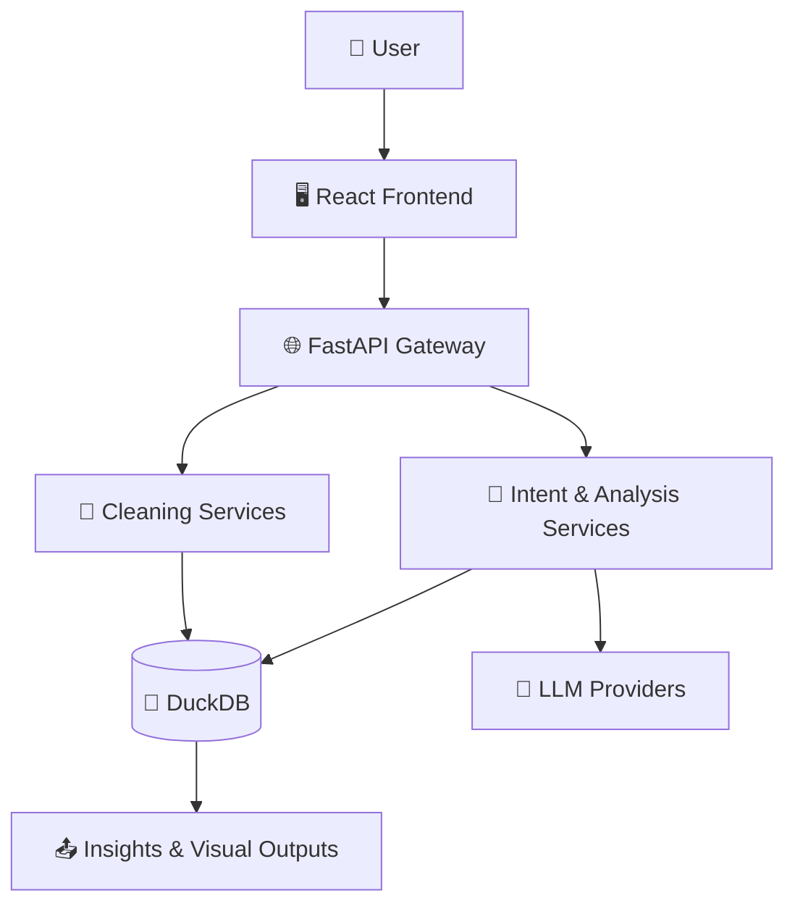

# ✨ Vizzy Analytics

<div align="center">

### 📊 AI-Powered Analytics • 🧠 Conversational Insights • ⚡ Fast Decisions


**Turn raw files into dashboards, KPIs, and explainable insights using natural language.**

[🚀 Quick Start](#-quick-start) • [🧩 Architecture](#-interactive-architecture) • [🎯 Features](#-feature-highlights) • [🛠️ Tech Stack](#️-tech-stack)

</div>

---

## 🌟 Why Vizzy Analytics?

- 💬 **Ask in plain English** — no SQL required for common analysis
- 📈 **Auto visualizations** — get chart suggestions from your data shape
- 🧼 **Data cleaning support** — profile quality and execute remediation actions
- 🧠 **Context-aware analytics** — follow-up questions keep session context
- 🔒 **Production-ready foundation** — API layer, validation, and scalable architecture

---

## 🎯 Feature Highlights

| Area | What you get |
|---|---|
| 🤖 Conversational Analytics | Intent-aware query understanding and analytics workflows |
| 📊 Smart Visualization | Chart recommendations + dashboard-ready outputs |
| 🧽 Cleaning Studio | Duplicate/null/type/outlier handling with transparent logic |
| 📚 Session Memory | Preserves context for multi-turn analysis |
| ⚙️ Extensible Engine | API-first backend with modular services |

---

## 🧩 Interactive Architecture

> Explore the system top-down, then expand each layer for details.



<details>
  <summary><strong>🖥️ Frontend Layer (React + TypeScript)</strong></summary>

- Modern UI built with React, TypeScript, Vite, Tailwind
- Dashboard, analytics, and chat-driven experiences
- State + async data flow via Zustand and TanStack Query

</details>

<details>
  <summary><strong>🌐 API Gateway (FastAPI)</strong></summary>

- Routes requests for analysis, cleaning, dashboards, and uploads
- Central place for request validation and response formatting
- Designed for secure and scalable integrations

</details>

<details>
  <summary><strong>🧠 Intelligence Layer</strong></summary>

- Intent mapping and query orchestration
- Analysis planning and execution workflows
- LLM-powered generation with deterministic safeguards

</details>

<details>
  <summary><strong>🦆 Data Layer (DuckDB + Connectors)</strong></summary>

- Fast in-memory analytics for uploaded datasets
- Handles tabular processing and SQL execution
- Ready for extension to external data sources

</details>

<details>
  <summary><strong>🧼 Data Cleaning Layer</strong></summary>

- Quality profiling and anomaly detection
- Guided cleaning actions (nulls, duplicates, type fixes)
- Produces cleaner data for more reliable analytics

</details>

---

## 🛠️ Tech Stack

### Frontend
- ⚛️ React 19
- 🔷 TypeScript
- ⚡ Vite
- 🎨 Tailwind CSS
- 🧠 Zustand
- 🔄 TanStack Query
- 📉 Recharts

### Backend
- 🚀 FastAPI
- 🐍 Python 3.10+
- 🦆 DuckDB
- 🔌 LLM Integrations (Groq / Gemini style providers)

---

## 🚀 Quick Start

### 1) Backend setup

```bash
cd backend
python -m venv venv
source venv/bin/activate  # Windows: venv\Scripts\activate
pip install -r requirements.txt
cp .env.example .env
# Add your API keys and config
uvicorn app.main:app --reload --host 0.0.0.0 --port 8000
```

Backend URL: `http://localhost:8000`  
API Docs: `http://localhost:8000/docs`

### 2) Frontend setup

```bash
cd frontend
npm install
cp .env.example .env
npm run dev
```

Frontend URL: `http://localhost:5173`

---

## 📂 Project Structure

```text
Vizzy-Analytics/
├── backend/         # FastAPI services, API routes, business logic
├── frontend/        # React app (analytics UI + dashboard)
├── README.md
└── .gitignore
```

---

## 🗺️ Product Direction

- [ ] Faster low-latency analysis paths
- [ ] Richer forecasting and predictive analytics
- [ ] Collaborative dashboards and sharing
- [ ] Expanded export/reporting options
- [ ] Better metadata, lineage, and data cataloging

---

## 🤝 Contributing

Contributions are welcome. Open an issue first for major changes.

## 📄 License

Licensed under the [MIT License](LICENSE).

---

<div align="center">

### 💡 Make analytics feel effortless.

If this project helps you, consider giving it a ⭐ on GitHub.

</div>
