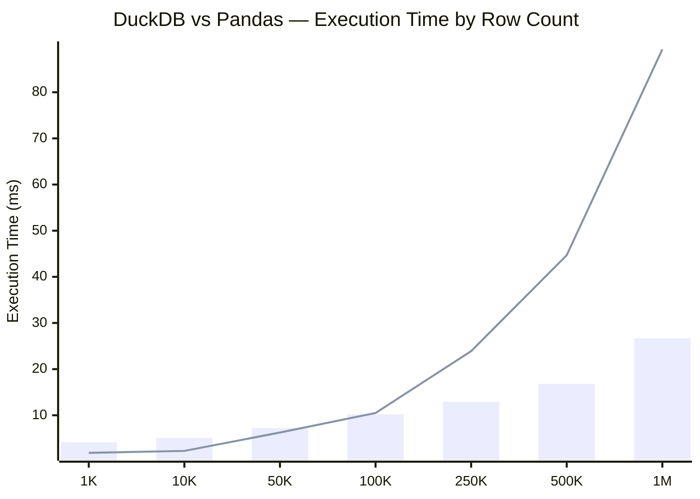
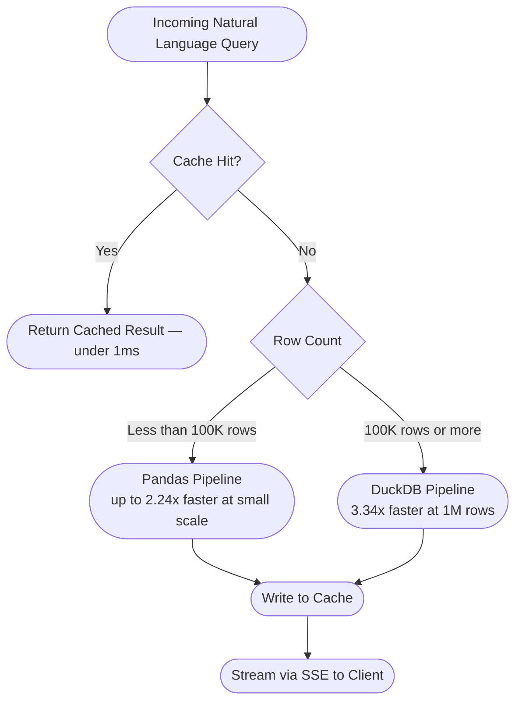
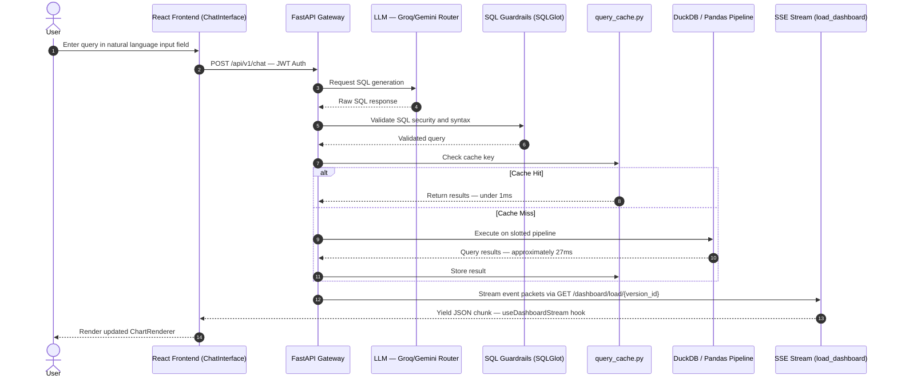
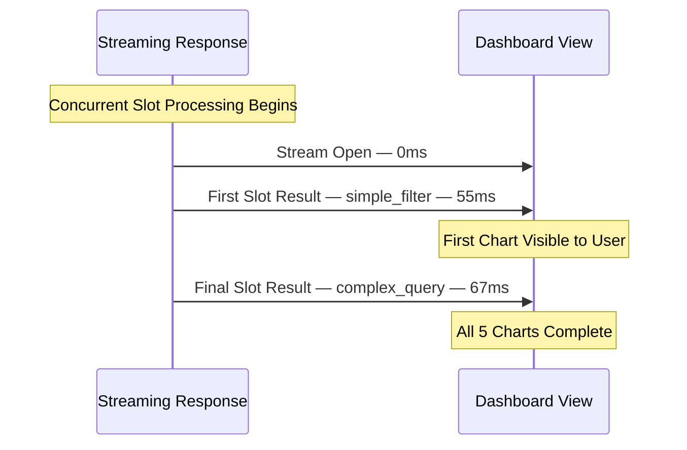
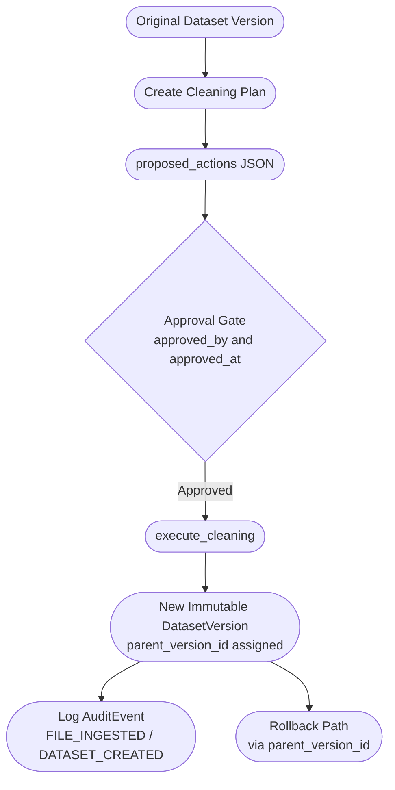
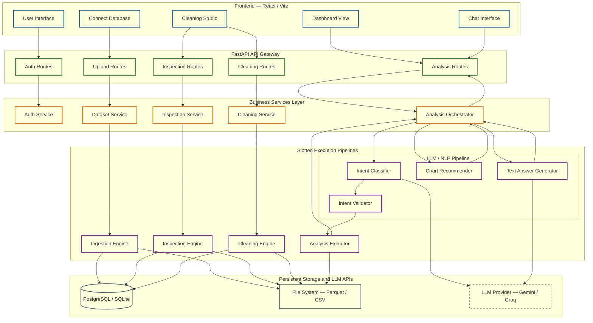

<div align="center">

<h1>⚡ Vizzy Analytics</h1>

<p><strong>Natural language to validated SQL. Hybrid execution engine. Immutable audit trail.</strong><br>
Ask your data a question. Get a chart. Every transformation tracked.</p>

<p>
  
  
  
  
</p>

<p>
  
  
  
  
  
  
  
</p>

<p>
  <a href="https://vizzy-ai-dqgw.vercel.app">🚀 Live Demo</a> &nbsp;·&nbsp;
  <a href="https://github.com/JAMIEL-J/Vizzy-Analytics">📂 GitHub</a> &nbsp;·&nbsp;
  <a href="#%EF%B8%8F-how-it-works">⚙️ How It Works</a> &nbsp;·&nbsp;
  <a href="#-performance-numbers">🔖 Benchmarks</a>
</p>

</div>

---

## The Problem

Data teams face a severe workflow bottleneck when non-technical stakeholders require custom aggregations or transformations, forcing analysts to manually write and debug SQL. When transformations are performed ad-hoc without structured tracking, data trust degrades as there is no record of how metrics were generated. Furthermore, when underlying database schemas change or files are re-uploaded, existing static dashboards break, leading to silent reporting errors and outdated visualizations.

## What Vizzy Does

Vizzy translates natural language queries into validated database operations, executing them against a versioned dataset while preserving a full audit trail of every transformation. It establishes an immutable lineage of data states by generating verifiable cleaning plans and re-mapping rules whenever dataset schemas or column mappings change. Stakeholders interact with auto-generated charts that immediately recalculate during client-side filter changes without corrupting the underlying dataset.

---

## 📊 Performance Numbers

> Benchmarked on: Intel i-series · 7.75GB RAM · Python 3.14 · [`run_benchmarks.py`](backend/benchmarks/run_benchmarks.py)

On this configuration the analytics engine achieves under 65ms p95 across all query types on a 1M row dataset, rendering a simple filter at p95 of 2.77ms and a complex multi-aggregation at p95 of 55ms. Query routing depends on dataset size: pandas is up to 2.24x faster below 100K rows, whereas DuckDB takes over at 100K rows and executes 3.34x faster than pandas at 1M rows. Caching reduces query latency from a cold state of ~27ms to under 1ms on warm hits. File ingestion processes a 10MB CSV in 371ms at 377K rows/second, scaling to 2.3 seconds for a 100MB CSV at 610K rows/second, with non-UTF-8 encoding fallbacks introducing ~70% execution overhead. Concurrent dashboard loading displays the first chart in 55ms, with all 5 slots completing in 67ms.

| Metric | Value |
|:---|:---|
| Simple filter · 1M rows | **2.77ms p95** |
| Complex multi-aggregation · 1M rows | **55ms p95** |
| DuckDB vs Pandas at 1M rows | **3.34x faster** |
| Routing crossover point | **~100K rows** |
| Cache cold → warm | **~27ms → <1ms** |
| Time to first chart (SSE) | **55ms** |
| All 5 dashboard slots complete | **67ms** |
| 100MB CSV ingestion | **2.3s · 610K rows/sec** |

**Bar = DuckDB execution time (ms) &nbsp;|&nbsp; Line = Pandas execution time (ms)**



> Pandas is faster below 100K rows. DuckDB scales efficiently, becoming 3.34x faster at 1M rows.

---

## ⚙️ How It Works

The request lifecycle begins when the user enters a natural language query in the React interface (`ChatInterface.tsx`). The frontend sends this query to the FastAPI backend (`POST /api/v1/chat`), where it is parsed by the LLM routing service (`app/services/llm/llm_router.py`). The router coordinates either a Groq or Gemini model to generate a valid SQL query based on constraints in `config.py` (timeout: 30 seconds, maximum token budget: 512). The generated SQL passes through SQLGlot validation guardrails to prevent injection or invalid syntax before proceeding.

Once validated, the query router (`app/services/analytics/execution_router.py`) evaluates execution size. For datasets under 100K rows, it routes to `pandas_pipeline.py` because pandas is up to 2.24x faster at small scale. For 100K rows or more, it routes to `duckdb_pipeline.py`, scaling to 3.34x faster than pandas at 1M rows. Before executing, the router checks the query cache (`app/services/analytics/query_cache.py`) using a cache key structured as `f"{dataset_id}:{version_id}:{chart_id}:{filters_json}"`. Cold cache executes in ~27ms; warm hits resolve under 1ms.



> Queries are cache-checked first, then routed by dataset size — minimising redundant database execution.

Results are yielded to the client via Server-Sent Events (`StreamingResponse` in `app/api/dashboard_load_routes.py`). The React hook `useDashboardStream` opens a persistent SSE connection (`GET /dashboard/load/{version_id}`), extracting token authorizations from query parameters since `EventSource` does not support custom headers. Streamed data updates the Zustand store (`useFilterStore`), which coordinates local filtering. Local filters apply directly to the in-memory sample (`rawData`), recalculating chart aggregates dynamically so that the database is not queried on simple filter changes.



> Server-side validation and cache-check run before results stream via EventSource to the client.



> All 5 dashboard slots execute concurrently. First chart visible in 55ms. Full dashboard complete in 67ms.

---

## 🧩 Feature Matrix

| Feature | What It Does | Measurable Behavior / Impact |
|:---|:---|:---|
| **Natural Language Querying** | Translates plain text to validated SQL using Groq or Gemini models. | A non-technical stakeholder retrieves a grouped KPI without writing or reviewing a single line of SQL. |
| **Hybrid Execution Routing** | Switches dynamically between Pandas and DuckDB based on a 100K row threshold. | Executes small datasets under 3ms (p95). Executes 1M-row datasets under 55ms (p95). |
| **Immutable Versioning** | Chains dataset changes using parent version IDs and approved semantic mapping states. | A cleaning operation applied at 2pm is fully reversible and auditable at 4pm with exact diff visibility. |
| **SSE Streaming** | Broadcasts dashboard slot results as each execution slot completes. | First chart visible in 55ms. Full 5-chart dashboard resolves in 67ms. |
| **Data Profiling & Schema Inference** | Evaluates data types, unique values, and cardinality ratios from a 50-row sample. | Identifies semantic column roles and blocks false positives like "percentage" or "usage" from misclassification. |
| **Data Cleaning Pipeline** | Performs outlier capping, string trimming, missing value interpolation, and duplicate removal. | Resolves NaT errors and scales parsing to 610K rows/sec on clean UTF-8 ingestion. |



> Versions chain through `parent_version_id` — every cleaning operation is reversible with full diff visibility at any point.

---

## 🏗️ Architecture



> Each UI page routes through a dedicated FastAPI handler → service → execution engine → storage. No cross-layer shortcuts.

---

## 🚀 Getting Started

**Prerequisites:** Python 3.10+ · Node.js 18+ · Groq or Gemini API key

**Backend**

```bash
cd backend
cp .env.example .env
pip install -r requirements.txt
uvicorn app.main:app --reload
```

API at `http://localhost:8000` · Docs at `http://localhost:8000/docs`

**Frontend**

```bash
cd frontend
npm install
npm run dev
```

App at `http://localhost:5173`

**Benchmarks**

```bash
python backend/benchmarks/run_benchmarks.py
# --quick flag for 5-iteration rapid run
```

Results saved to `backend/benchmarks/results.json`

---

## 🛠️ Tech Stack

<div align="center">
  
</div>

<br>

| Layer | Technologies |
|:---|:---|
| **Frontend** | React 19, TypeScript, Vite, Tailwind CSS, Zustand, Chart.js (react-chartjs-2) |
| **Backend** | Python 3.10+, FastAPI, SQLModel, Python-jose |
| **Execution** | DuckDB, Pandas, SQLGlot |
| **LLM** | Groq API, Gemini API |
| **Deployment** | Vercel (frontend), Uvicorn (backend) |

---

<div align="center">
  <a href="https://vizzy-ai-dqgw.vercel.app">
    
  </a>
  <br><br>
  <sub>Benchmarked on Intel i-series · 7.75GB RAM · Python 3.14 · All numbers reproducible via <code>run_benchmarks.py</code></sub>
</div>