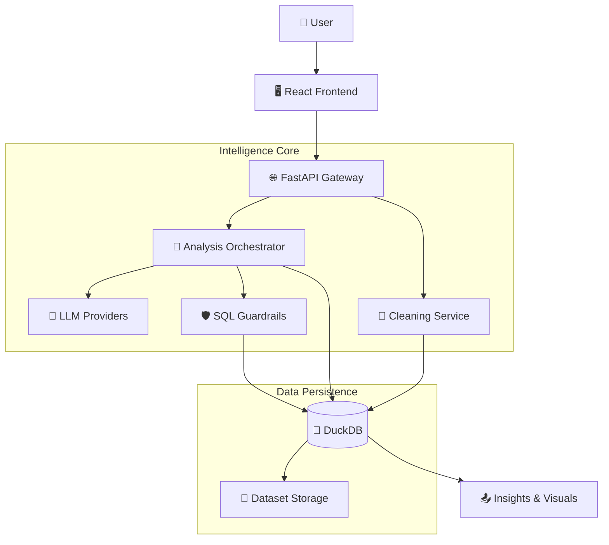

# <div align="center">✨ Vizzy Analytics</div>

<div align="center">

**Turn raw tabular data into conversational insights, automated KPIs, and explainable visualizations.**

[](LICENSE)
[](https://fastapi.tiangolo.com/)
[](https://react.dev/)
[](https://duckdb.org/)
[](https://www.python.org/)

[🚀 Quick Start](#-getting-started) • [🧩 Architecture](#-system-blueprint) • [🛠️ Tech Stack](#️-the-tech-stack) • [🗺️ Roadmap](#-product-roadmap)

</div>

---

## 🌟 The Vision

Vizzy is a **trust-first analytics platform** designed to bridge the gap between raw data and decision-making. Instead of wrestling with SQL or complex BI tools, Vizzy allows users to interact with their data using **natural language**, providing a conversational interface that generates accurate KPIs, charts, and insights with deterministic guardrails.

### ⚡ Key Value Propositions

- 💬 **Conversational Intelligence**: Ask questions in plain English. No SQL knowledge required.
- 📈 **Smart Visualizations**: Auto-suggests the best chart type based on data dimensions and metrics.
- 🧼 **Transparent Data Cleaning**: Guided remediation for nulls, duplicates, and outliers with a full audit trail.
- 🧠 **Session Context**: Maintains conversational memory for deep-dive, multi-turn analysis.
- 🔒 **Enterprise Foundation**: Built with an immutable versioning model and explicit approval workflows.

---

## 🎯 Feature Matrix

| Feature | Description | Impact |
| :--- | :--- | :--- |
| **NL $\to$ SQL Engine** | Maps natural language intent to optimized DuckDB queries. | ⏱️ Zero-SQL Analysis |
| **Visualization Studio** | Generates dashboard-ready charts (Pie, Bar, Line, Donut). | 📊 Instant Reporting |
| **Cleaning Studio** | Profiling & remediation of tabular datasets. | 🧽 High Data Trust |
| **Conversation Memory** | Retains state across multiple analytical queries. | 🔄 Fluid Exploration |
| **Version Control** | Immutable snapshots of datasets and cleaning plans. | 🛡️ Full Auditability |

---

## 🧩 System Blueprint

Vizzy employs a decoupled architecture to ensure scalability and reliability.



### 🏗️ Layer Breakdown
- **Frontend**: A high-performance React 19 application utilizing **Zustand** for state and **TanStack Query** for async synchronization.
- **API Gateway**: A robust FastAPI layer handling authentication, request validation, and rate limiting.
- **Intelligence Core**: A modular service layer that orchestrates LLM-generated SQL, validates it against security constraints, and executes it via DuckDB.
- **Data Layer**: Leverages **DuckDB** for blazing-fast in-memory analytical processing of tabular data.

---

## 🛠️ The Tech Stack

### 🎨 Frontend Experience
- **Framework**: `React 19` + `TypeScript` + `Vite`
- **Styling**: `Tailwind CSS` (Custom design system)
- **State Management**: `Zustand`
- **Data Fetching**: `TanStack Query`
- **Visuals**: `Chart.js` + `react-chartjs-2`

### ⚙️ Backend Powerhouse
- **Language**: `Python 3.10+`
- **API Framework**: `FastAPI`
- **Analytics Engine**: `DuckDB`
- **Data Modeling**: `SQLModel`
- **LLM Integration**: Groq / Gemini (Unified Client)

---

<div align="center">

### 🛠️ Powered By
<a href="https://skillicons.dev">
  
</a>

<div style="margin-top: 10px;">
  
  
  
  
</div>

</div>

---

## 🚀 Getting Started

### 📋 Prerequisites
- Python 3.10+
- Node.js 18+
- An LLM API Key (Groq/Gemini)

### 🧭 Fresh Laptop Setup
1. Clone the repository and open the workspace root.
2. Set up the backend first, because the frontend points at the API.
3. Set up the frontend `.env` with `VITE_API_URL=http://localhost:8000/api/v1`.
4. Start the backend on port `8000`, then start the frontend on port `5173`.

### 🛠️ Backend Installation
```bash
# Navigate to backend
cd backend

# Setup virtual environment
python -m venv .venv
# Windows: .\\.venv\\Scripts\\activate
# Mac/Linux: source .venv/bin/activate

# Install dependencies
pip install -r requirements.txt

# Environment configuration
cp .env.example .env
# Edit .env and add your API keys

# Start the server
python -m uvicorn app.main:app --reload --host 0.0.0.0 --port 8000
```
**API Base**: `http://localhost:8000/api/v1` | **Docs**: `http://localhost:8000/docs`

### 💻 Frontend Installation
```bash
# Navigate to frontend
cd frontend

# Install packages
npm install

# Environment configuration
# Ensure frontend/.env contains VITE_API_URL=http://localhost:8000/api/v1

# Launch development server
npm run dev
```
**App URL**: `http://localhost:5173`  
**API URL**: `http://localhost:8000/api/v1`

### 📦 Chart Library Notes
- The frontend charts now use `Chart.js` and `react-chartjs-2`.
- Run `npm install` in `frontend/` to ensure the Chart.js packages from `package.json` are present on the new laptop.

---

## 🗺️ Product Roadmap

- [ ] **⚡ Ultra-Low Latency**: Implementation of optimized caching layers for common queries.
- [ ] **🔮 Predictive Analytics**: Integrating forecasting models for time-series data.
- [ ] **🤝 Collaboration**: Shared workspaces and collaborative dashboard editing.
- [ ] **📄 Advanced Export**: One-click export to PDF, Excel, and professional report formats.
- [ ] **🏷️ Data Catalog**: Comprehensive metadata management and data lineage tracking.

---

## 🤝 Contributing

We welcome contributions to make Vizzy even more powerful. Please follow these steps:
1. Fork the repository.
2. Create a feature branch (`git checkout -b feature/AmazingFeature`).
3. Commit your changes (`git commit -m 'Add some AmazingFeature'`).
4. Push to the branch (`git push origin feature/AmazingFeature`).
5. Open a Pull Request.

---

## 📄 License

This project is licensed under the **MIT License**. See the [LICENSE](LICENSE) file for details.

---

<div align="center">

### 💡 Make analytics feel effortless.

If you find this project useful, consider giving it a ⭐ on GitHub to support its development!

</div>
